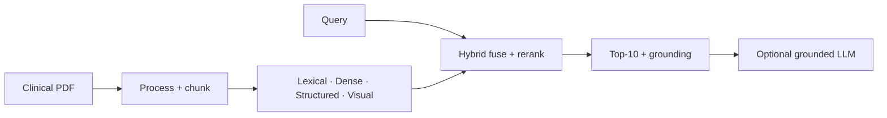
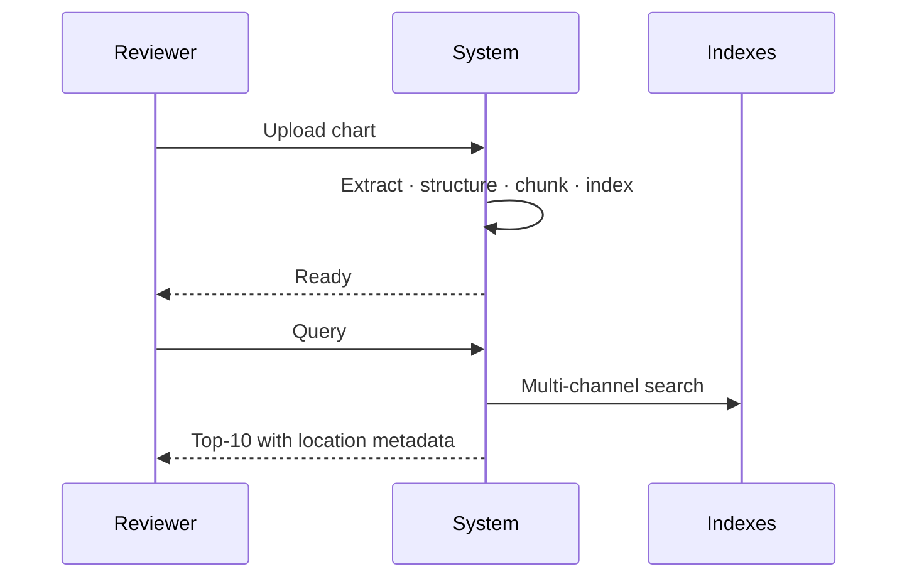
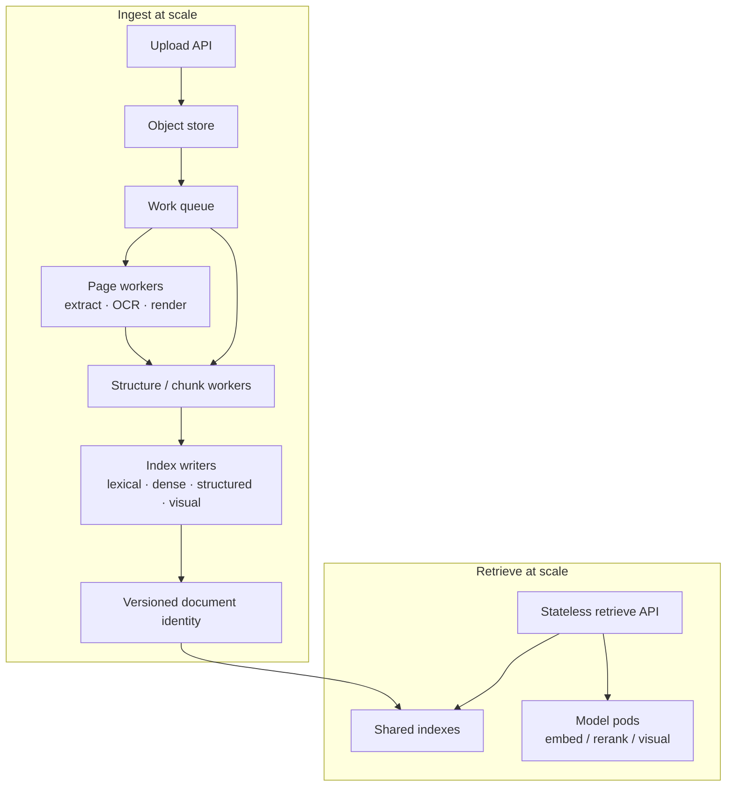
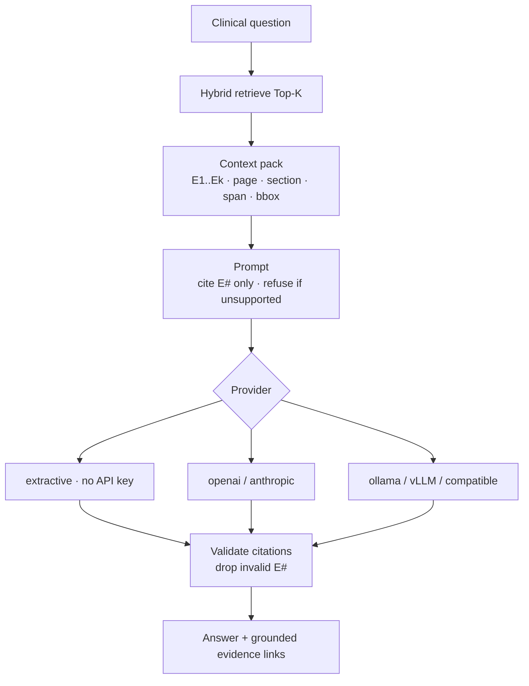

# Design Document — Clinical Document Retrieval

**Assignment Part 2** · System design scenarios  
**Implementation:** hybrid multimodal retrieval with evidence grounding  
**Time spent:** ~8 hours

---

## Implemented architecture (reference)

---

## Scenario 1 — Evaluation

### Goals
Assess three layers beyond the assignment’s primary score: **did we find the evidence**, **can a reviewer locate it in the chart**, and **which parts of the architecture actually matter**.

### Metrics we report
| Layer | What we measure | Report |
|-------|-----------------|--------|
| Retrieval | Hit@1/3/5/10, Recall@10, MRR@10, nDCG@10, precision, duplicate rate | `outputs/evaluation_summary.json` |
| Grounding | Page agreement, field completeness (document / page / section / span / bbox) | `outputs/grounding_report.json` |
| Channels | Recall@10 when channels are added or removed | `outputs/ablation_summary.json` |
| Latency | mean / p50 / p95 for the **full** retrieve path | `outputs/latency_profile.json` |

### How we validate
1. **Gold-set gate** — Run the provided evaluation queries with **query text only** (no ground-truth in the retriever). Success criterion: gold evidence appears somewhere in Top-10 for every query (Recall@10 = 1.0).
2. **Grounding check** — For each hit that matches gold text, confirm the returned page overlaps the expected pages and that section, character span, and bounding box are present so a reviewer never needs the raw PDF.
3. **Miss triage** — Tag failures as “not retrieved” vs “retrieved but wrong page/location” for debugging.
4. **Ablation study** — Turn channels on/off (lexical, dense, structured, visual, rerank) to show why the hybrid design beats any single channel.
5. **Manual review** — Spot-check Top-10 lists: jump via page + bbox and confirm clinical relevance of non-gold neighbors.
6. **Stretch goals** — Holdout queries, double-annotation of grounding, and CI against the gold set after changes.

### What these reports show (results with this architecture)

**Retrieval (`evaluation_summary.json`) — 18 queries**

| Metric | Result | Meaning |
|--------|--------|---------|
| Recall@10 / Hit@10 | **1.0** | Gold evidence in Top-10 for **all 18** queries |
| Hit@5 | 0.94 | Almost all solved by rank ≤ 5 |
| Hit@1 | 0.67 | Correct chunk is #1 for ~⅔ of queries |
| MRR@10 | 0.78 | Strong average rank of first relevant hit |
| nDCG@10 | 0.83 | Rank-sensitive quality is solid, not only “somewhere in 10” |
| Missed queries | **none** | No uncovered gold cases on this set |
| Mean / p95 latency | ~1.1s / ~1.9s | Online retrieve cost on the eval run |

This is the assignment primary bar: hybrid fusion + rerank recovers every gold span within Top-10.

**Grounding (`grounding_report.json`)**

| Check | Result | Meaning |
|-------|--------|---------|
| Fully grounded matched hits | **1.0** | When we match gold text, location fields are complete |
| Missing document / page / section / span / bbox | **0** on matched hits | Traceability contract holds |
| Mean Top-K fully grounded | **10.0** | Every returned slot carries grounding metadata |
| Page agreement among hits | ~0.78 | Most matched hits land on the gold page(s); residual gap is page-overlap strictness, not empty metadata |

So Task 3 is not bolted on: processing stores page/section/span/bbox, and retrieve returns them unchanged.

**Ablations (`ablation_summary.json`) — why the architecture looks this way**

| Setup | Recall@10 | Takeaway |
|-------|-----------|----------|
| BM25 only | 0.72 | Keywords alone miss paraphrases |
| Dense only | 0.67 | Semantics alone miss exact clinical needles |
| BM25 + dense | 0.72 | Need structure / rerank for the hard tail |
| BM25 + dense + structured | 0.83 | Entity/date channel lifts recall |
| + visual (no full stack) | 0.94 | Layout channel helps some hard pages |
| Full **without** rerank | 0.83 | Candidates exist but ranking is weaker |
| **Full + rerank** | **1.0** | Reranker closes the last gaps to perfect Hit@10 |

Architecture claim: **no single channel is enough**; fusion gets candidates in range, **rerank converts that into Recall@10 = 1.0**.

**Latency (`latency_profile.json`) — full pipeline only**

| Stat | Value (sample run, n=6) |
|------|-------------------------|
| Mean | ~1.2 s |
| p50 | ~1.1 s |
| p95 | ~1.8 s |
| One-time model load | ~29 s (amortized after warm-up) |

We profile the **full** path only (same path used for evaluation and the reviewer UI retrieve), not a reduced “api” mode.

### Document-processing checks
Chunk coverage (including OCR pages), bbox fill rate, encounter/section counts, and header/footer stripping without dropping encounter markers.

---

## Scenario 2 — Scalability

### Target
Thousands of clinical PDFs per day, with individual charts **>500 pages** (our sample chart is ~1,092 pages).

### Architecture (production target)

**Production path (conceptual)**

1. **Ingest:** clients upload → durable object storage → queued jobs.  
2. **Workers:** page-parallel extract/OCR/render; then structure + chunk; then index writers (sharded lexical, vector upsert, structured DB, optional visual).  
3. **Versioning:** each build is keyed by document identity + processing version so rollouts and retries stay idempotent.  
4. **Retrieve:** stateless API over shared indexes and dedicated model pods (embed / rerank / visual pools).

**What we ship today (demo-scale)**  
A single-active-document loop in the reviewer UI: upload → process → rebuild indexes → search. A small file-backed job queue shows the same job lifecycle and can be replaced later with Redis/SQS plus sharded writers—without changing the core process/chunk/index/retrieve design.

### Concurrency & resources
- Shard work **by document**; inside a chart, batch pages with checkpointed layout conversion.
- Separate GPU pools for embed / visual / rerank to avoid OOM.
- CPU workers for extract + lexical indexing; scale on queue depth.
- Warm model singletons on the retrieve path; load visual lazily when needed.

### Fault tolerance
- Idempotent jobs on `(document id, processing version, content hash)`.
- Resume long OCR/layout runs from checkpoints; dead-letter after N failures.
- Per-document index publish (alias swap) so readers never see half-built state.

### Monitoring
- Ingest lag, pages/sec, queue age, GPU util, gold Recall@10 canary, p95 retrieve latency.
- Structured logs with job and document IDs; alert on OCR spikes and vector-store errors.

### Efficient utilization
- Skip re-layout when artifacts are fresh; dedupe identical page images.
- Hot indexes on SSD/memory; cold page images in object storage.
- Re-embed only documents that changed.

---

## Scenario 3 — LLM Integration

Retrieval stays the source of truth; the LLM **only reasons over retrieved, cited evidence**.

### Flow (implemented)

Flow (API answer mode / CLI):
1. Hybrid retrieve Top-K (default 5–8 for token budget).
2. **Context preparation** — pack chunks as numbered evidence blocks with page, section, span/bbox; truncate long chunks; prefer diverse encounters.
3. **Prompt construction** — cite evidence IDs only; refuse if unsupported.
4. **LLM backends** — open-source (Ollama / local compatible) or closed-source (OpenAI / Anthropic).
5. **Grounding strategy** — every claim binds to an evidence ID with location metadata.
6. **Hallucination prevention** — no memory answers; empty evidence → insufficient evidence; extractive mode needs no LLM.
7. **Response validation** — drop/flag claims without valid evidence IDs.
8. **Latency / tokens** — shrink Top-K; cache retrieve; cap output tokens.

### Safety note
Not for unsupervised clinical decision-making; outputs are for assisted review with mandatory source links.

---

## Deliverable checklist

| Item | How to run |
|------|------------|
| Retrieval + Recall@10 | `make evaluate` |
| Grounding audit | written with evaluation outputs |
| Scale stubs | enqueue / worker scripts (file-backed queue) |
| LLM answer | answer CLI or API answer mode |
| Ablations / latency | `make ablate` · `make latency` |
