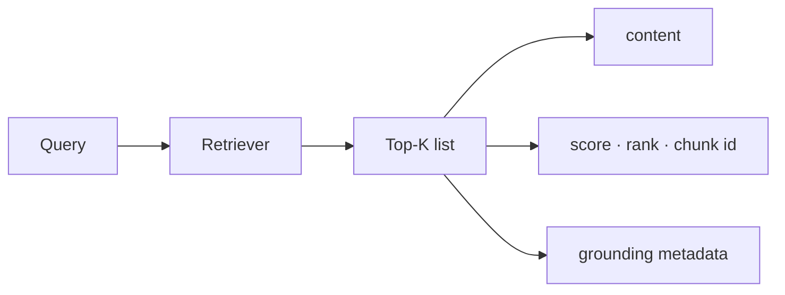

# Retrieval outputs explained

This document describes **what the system returns** after retrieval (and what the evaluation reports mean).  
Architecture: [`README.md`](README.md) · How to run: [`RUNBOOK.md`](RUNBOOK.md) · Design / metrics story: [`DESIGN.md`](DESIGN.md)

---

## What you get (big picture)

For every user query the system returns a **ranked Top-K list** (K ≤ 10 by default).  
Each item is one evidence chunk with:

1. **What was found** — chunk text  
2. **How strong it is** — relevance score + rank  
3. **Where it lives in the PDF** — document, page, section, character span, bounding box  

That matches the assignment: Task 2 (Top-K retrieval) + Task 3 (grounding metadata on every hit).



How to produce outputs:

| Path | Command / action | Main artifacts |
|------|------------------|----------------|
| Full eval | `make evaluate` | `outputs/evaluation_summary.json`, `retrieval_results.json`, `grounding_report.json` |
| UI / API | Search in UI or `POST /retrieve` | Same shape as one query’s `results[]` |
| One query CLI | `make retrieve QUERY='...'` | Printed JSON with the same fields |

---

## 1) Per-query retrieval payload

Shape (same for eval dump, API `/retrieve`, and UI):

```json
{
  "query_id": "Q001",
  "query": "What is the patient's blood type?",
  "results": [
    {
      "rank": 1,
      "chunk_id": "PT55188_SECTION_08738",
      "score": 0.874,
      "content": "Patient Demographics\n...\nBlood Type\nA+\n...",
      "metadata": { "... grounding fields ..." }
    }
  ]
}
```

### Top-level fields

| Field | Meaning |
|-------|---------|
| `query_id` | Stable id (eval set uses Q001…Q018; UI may use `ui`) |
| `query` | Exact question string sent to the retriever (**query text only** — no gold labels) |
| `results` | Ranked list, best first; length ≤ Top-K (usually 10) |

### Each result item (Task 2)

| Field | Meaning |
|-------|---------|
| `rank` | Position in Top-K (`1` = best) |
| `chunk_id` | Unique id of the stored chunk (resolvable back to the processed corpus) |
| `score` | Final relevance score after fusion + rerank (higher = more relevant) |
| `content` | Chunk text shown to the reviewer (the clinical evidence passage) |

### Grounding metadata (Task 3)

These fields let a reviewer **find the evidence in the PDF without guessing**:

| Field | Meaning |
|-------|---------|
| `document_id` | Logical chart id (e.g. patient/chart identifier) |
| `source_document` | Original PDF name |
| `patient_id` | Patient id associated with the chart |
| `page` / `page_start` / `page_end` | Page number(s) where the chunk lives |
| `section` | Section / heading when known (e.g. Patient Demographics) |
| `character_span` / `char_start` + `char_end` | Character offsets for the span on the page/section text |
| `bounding_box` / `bounding_boxes` | PDF coordinates `[x0, y0, x1, y1]` (and per-block boxes) for visual jump |
| `encounter_id` / `encounter_date` / `encounter_type` | Visit context when the chunk is encounter-scoped |
| `provider` / `facility` | Clinician / site when extracted |
| `chunk_type` | Granularity: `section`, `atomic`, `compound`, `page_visual`, … |

**Example reading (blood-type query):**

- Rank **1**, score **0.874**, section **Patient Demographics**  
- Pages **2–3**, span **[0, 366]**, primary bbox on page 2  
- Content includes **Blood Type A+** → reviewer can open page 2 and match the box

Neighbor ranks (2, 3, …) are other candidates; they may be shorter atomic facts (e.g. `Blood Type: A+`) or related demographics — useful for precision review even when only one chunk is “gold.”

---

## 2) Evaluation dump — `outputs/retrieval_results.json`

Produced by `make evaluate`.

- Array of **one object per evaluation query** (18 for the gold set).  
- Each object has the same `query_id` / `query` / `results[≤10]` shape as above.  
- Used to audit: “for this question, what did we return, in what order, with which grounding?”

This file is large (full Top-10 × all queries) and usually **gitignored**; regenerate with `make evaluate`. Compact scores live in `evaluation_summary.json`.

---

## 3) Aggregate scores — `outputs/evaluation_summary.json`

One scoreboard for the whole gold set after retrieve + match against ground-truth evidence text.

| Field | What it means (our run) |
|-------|-------------------------|
| `n_queries` | Number of eval questions (**18**) |
| `recall_at_10` / `hit_at_10` | **1.0** — gold evidence appeared in Top-10 for every query |
| `hit_at_1` / `hit_at_3` / `hit_at_5` | Fraction solved by rank ≤ 1 / 3 / 5 (e.g. ~0.67 / 0.83 / 0.94) |
| `mrr_at_10` | Mean reciprocal rank of first relevant hit (~**0.78**) — rewards putting gold higher |
| `ndcg_at_10` | Rank-sensitive quality (~**0.83**) |
| `precision_at_10` | Share of Top-10 slots that are gold matches (often low when only one gold span exists per query) |
| `page_hit_at_10` | Fraction of queries where a Top-10 hit lands on an expected page |
| `page_overlap_accuracy` | Stricter page agreement with gold locations |
| `duplicate_result_ratio` | Near-duplicate hits in Top-10 (**0** = clean list) |
| `missed_queries` | Query ids with no gold in Top-10 (**[]** = none missed) |
| `avg_latency_sec` / `p95_latency_sec` | Online retrieve timing on this eval run |

**How to read success for the assignment:** focus on **Recall@10 / Hit@10 = 1.0**; use MRR/nDCG as secondary rank quality; use grounding report for Task 3 location checks.

---

## 4) Grounding report — `outputs/grounding_report.json`

Checks whether matched evidence carries **usable location metadata**.

| Summary field | Meaning (our run) |
|---------------|-------------------|
| `fully_grounded_matched_hits` | **1.0** — matched hits include required location fields |
| `field_missing_on_matched_hits` | Counts of missing document/page/section/span/bbox (**0** on matched hits) |
| `mean_top_k_fully_grounded` | **10.0** — every Top-10 slot carries grounding |
| `page_agreement_among_hits` | ~**0.78** — page alignment vs gold when evidence text matches |

`per_query[]` lists each question’s match status, page overlap, and the concrete grounding fields on the matched chunk.

---

## 5) Ablation report — `outputs/ablation_summary.json`

Shows what happens if you remove channels (why hybrid + rerank):

| Setup (example) | Recall@10 | Read as |
|-----------------|-----------|---------|
| Single channel (BM25 or dense only) | ~0.67–0.72 | Not enough alone |
| Full without rerank | ~0.83 | Candidates OK, ranking weaker |
| **Full with rerank** | **1.0** | Architecture as shipped |

---

## 6) Latency — `outputs/latency_profile.json`

Full retrieve path only (mean / p50 / p95). Used to discuss interactive cost, not a second “api” mode.

---

## 7) UI / API answer mode (optional)

If Mode = **Retrieve + grounded answer** (`POST /answer`):

```json
{
  "retrieval": { "query_id": "...", "query": "...", "results": [ /* same Top-K as above */ ] },
  "generation": {
    "answer": "...",
    "provider": "extractive",
    "citations_used": ["E1", "E3"],
    "grounded": true
  }
}
```

| Piece | Meaning |
|-------|---------|
| `retrieval` | Same Top-K + grounding as Task 2/3 |
| `generation.answer` | Short answer built **only** from retrieved evidence |
| `citations_used` | Which evidence blocks (`E#`) were cited |
| `grounded` | Whether citation validation succeeded |

Assignment grading still centers on **Top-10 retrieval + grounding**, not the LLM prose.

---

## 8) How a reviewer should inspect an output

1. Open `outputs/evaluation_summary.json` → confirm **Recall@10 = 1.0**, empty `missed_queries`.  
2. Pick one query in `retrieval_results.json` → read rank-1 `content` + `page` / `section` / `bounding_box`.  
3. Mentally jump to that page in the chart — Task 3 satisfied if location matches.  
4. Optionally open `grounding_report.json` for that `query_id` for field-level audit.  
5. Use `ablation_summary.json` if you want proof that hybrid + rerank was necessary.

---

## Quick map: assignment → files

| Assignment ask | Where you see it |
|----------------|------------------|
| Top-K chunks + score + metadata | `retrieval_results.json` / UI hits / `POST /retrieve` |
| Recall@10 (+ rank metrics) | `evaluation_summary.json` |
| Grounding accuracy / completeness | `grounding_report.json` (+ metadata on each hit) |
| Why this architecture | `ablation_summary.json` + [`DESIGN.md`](DESIGN.md) |
