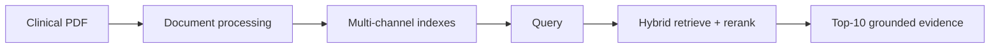
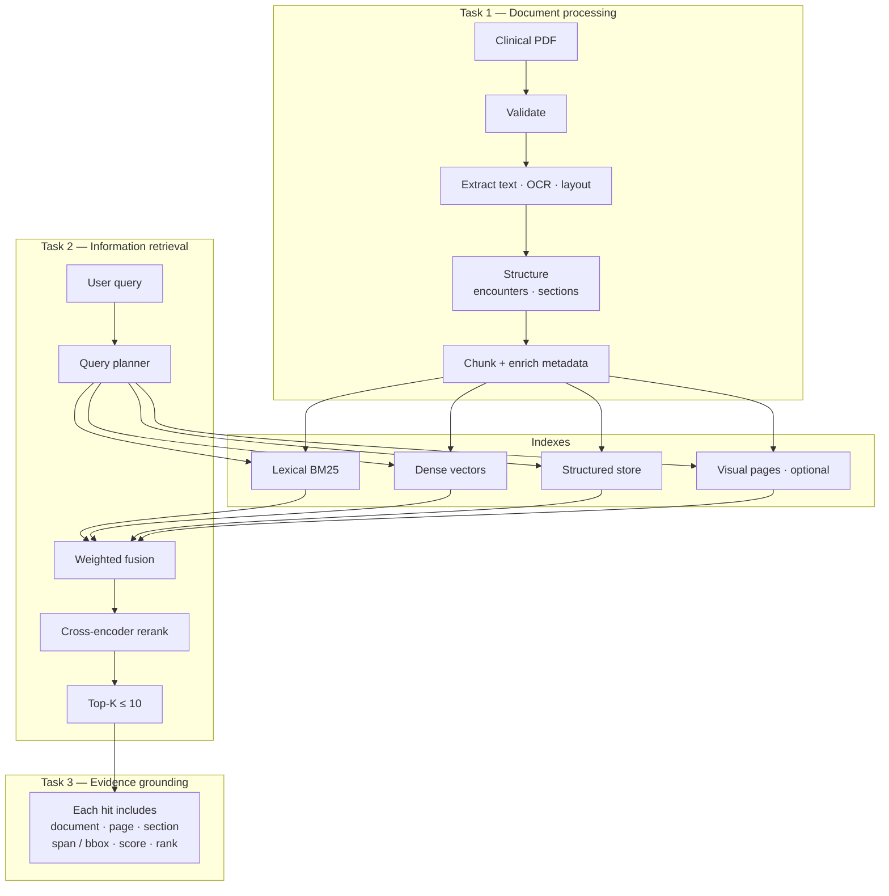
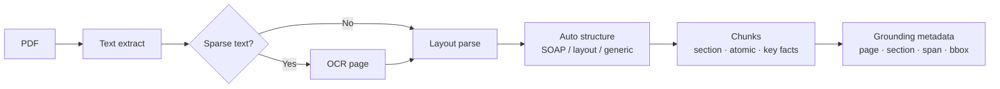
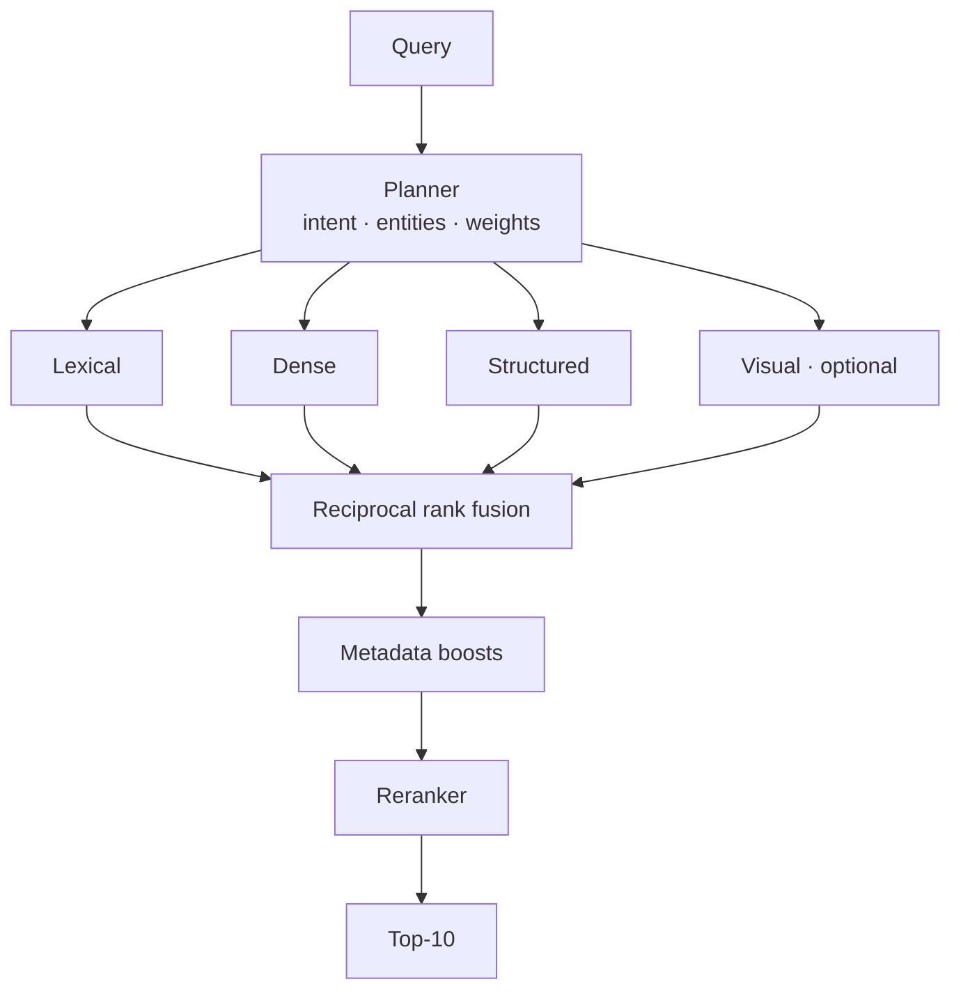
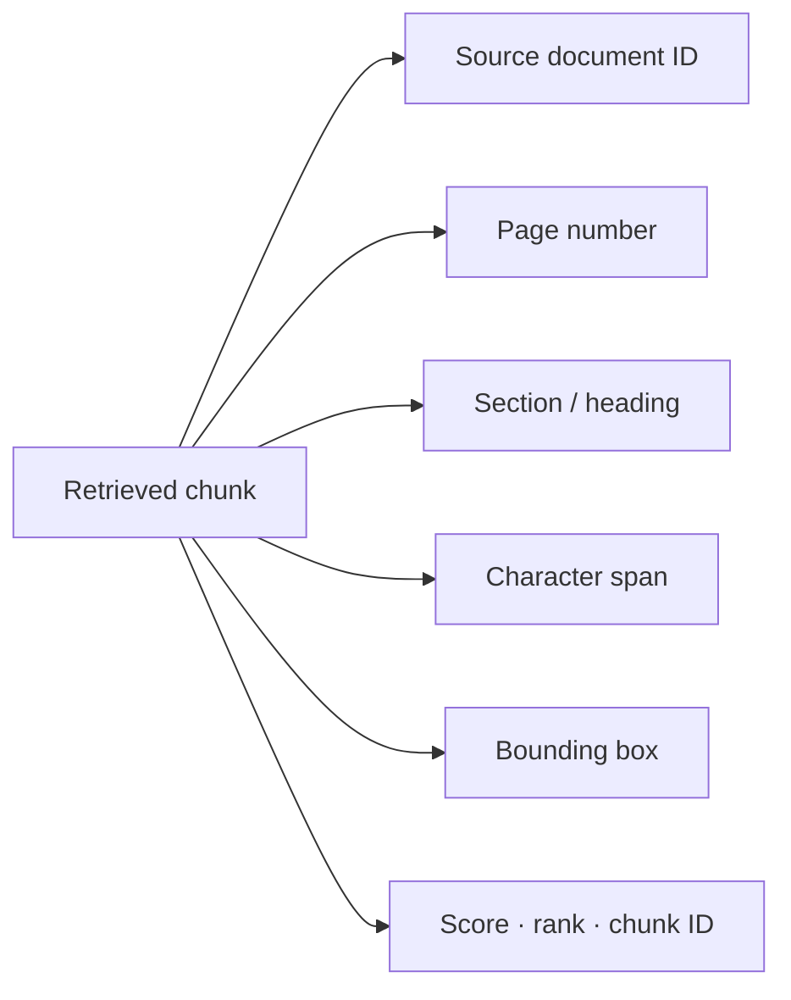
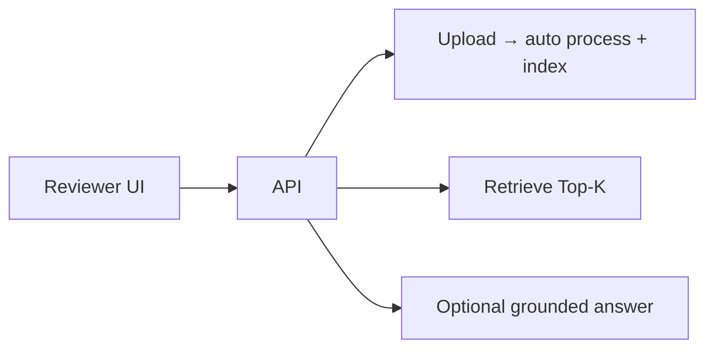

# Clinical Document Retrieval

**AI/ML (Generative AI) take-home — Clinical Document Processing & Information Retrieval**

Hybrid retrieval over clinical PDFs with **evidence grounding** (document · page · section · span / bbox · score).

| Assignment focus | How this repo addresses it | What we got |
|------------------|----------------------------|-------------|
| **Task 1** Document processing | Extract → structure → multi-granularity chunks + metadata | Grounded chunks with page / section / span / bbox on the full chart |
| **Task 2** Information retrieval | Hybrid channels + fusion + rerank → Top-10 | **Recall@10 = 1.0** (18/18); Hit@5 ≈ 0.94; MRR@10 ≈ 0.78; nDCG@10 ≈ 0.83 |
| **Task 3** Evidence grounding | Every hit carries location metadata for traceability | Matched hits **100%** fully grounded; Top-10 slots all carry location fields |
| **Part 2** System design | See [`DESIGN.md`](DESIGN.md) | Eval / scale / LLM scenarios + report interpretation |
| **Outputs (review)** | Top-K dump + scoreboard + grounding / ablation reports | See [`OUTPUTS.md`](OUTPUTS.md) · `outputs/evaluation_summary.json` |

### Models used

| Role | Model | Notes |
|------|--------|--------|
| **Dense embeddings** | [`Qwen/Qwen3-Embedding-0.6B`](https://huggingface.co/Qwen/Qwen3-Embedding-0.6B) | Semantic retrieval → Qdrant (1024-d) |
| **Reranker** | [`Qwen/Qwen3-Reranker-0.6B`](https://huggingface.co/Qwen/Qwen3-Reranker-0.6B) | Cross-encoder over fused candidates (critical for Recall@10 = 1.0) |
| **Visual retrieval (optional)** | [`vidore/colqwen2.5-v0.2`](https://huggingface.co/vidore/colqwen2.5-v0.2) | Page-image channel for scans / tables; off by default in fast UI upload |
| **Lexical** | BM25 (`rank-bm25`) | Exact / keyword clinical terms — no neural model |
| **Structured** | SQLite entity / posting store | Dates, meds, labs, ICD-style fields — no LLM |
| **Parse / OCR** | PyMuPDF + Docling + Tesseract (optional) | Text, layout, scanned pages |
| **Answer (optional demo)** | Extractive (default) or OpenAI / Anthropic / Ollama | Not required for assignment Recall@10 |

Device: `DEVICE=auto` (CUDA if available, else CPU). Config: `configs/default.yaml` → `models.*`.

---

## System architecture

Three stages: **process the chart → index it → retrieve with grounding**.



### End-to-end architecture



### Document processing (Task 1)



### Information retrieval (Task 2)



| Channel | Why it exists |
|---------|----------------|
| Lexical (BM25 / exact) | IDs, meds, exact phrases |
| Dense | Semantic paraphrase |
| Structured | Dates, labs, ICD-style fields |
| Visual (optional) | Scans / tables / layout-heavy pages |
| Reranker | Precision inside the fused shortlist |

### Evidence grounding (Task 3)



### Runtime surfaces



---

## Setup and quick start

**Requirements:** Python **3.10+**, Docker (Qdrant), optional CUDA (`DEVICE=auto`).

```bash
git clone https://github.com/Datastar07/clinical_document_retrieval.git
cd clinical_document_retrieval

export PYTHONPATH=src
export TRANSFORMERS_NO_TF=1
export USE_TF=0

python3 -m pip install -e ".[dev,api]"
make qdrant
```

**Reproduce Recall@10 (assignment metric):**

```bash
make ingest
make index-novisual DEVICE=auto
make evaluate DEVICE=auto
# → outputs/evaluation_summary.json  (expected Recall@10 = 1.0)
```

**Reviewer UI:**

```bash
make api DEVICE=auto
# → http://127.0.0.1:9006/   ·  Swagger /docs  ·  health /health
```

For **all run cases** (upload another PDF, CPU-only, visual on/off, CLI retrieve/answer, ablations, troubleshooting), see:

**→ [`RUNBOOK.md`](RUNBOOK.md)**

For a **detailed explanation of retrieval outputs** (Top-K fields, grounding metadata, eval reports, how to read them):

**→ [`OUTPUTS.md`](OUTPUTS.md)**

---

## Project structure

```text
clinical_document_retrieval/
├── DESIGN.md                 # Part 2 — evaluation / scale / LLM
├── README.md                 # Architecture + deliverables
├── RUNBOOK.md                # Full how-to-run guide (all cases)
├── OUTPUTS.md                # What retrieval returns (fields + reports)
├── Makefile
├── compose.yaml              # Qdrant
├── configs/                  # Runtime + lexicon config
├── data/
│   ├── raw/                  # Source / uploaded PDFs
│   └── evaluation/           # Evaluation JSON
├── src/clinical_retrieval/
│   ├── api/                  # FastAPI + reviewer UI
│   ├── ingestion/            # PDF extract, OCR, layout
│   ├── structure/            # Encounter / section parsers
│   ├── chunking/             # Chunks + grounding
│   ├── indexing/             # BM25, dense, structured, visual
│   ├── retrieval/            # Hybrid retrieve + rerank
│   ├── generation/           # Optional grounded answers
│   └── evaluation/           # Metrics + grounding audit
├── scripts/                  # ingest · index · evaluate · serve
└── outputs/                  # Metric summaries
```

Heavy artifacts (embeddings, pickles, full Top-10 dumps) are gitignored; rebuild with ingest/index or UI upload.

---

## Assumptions

- One primary clinical chart + the provided evaluation JSON for grading.
- Retrieval input is **query text only** (no ground-truth leakage).
- Top-K ≤ 10; success = ground-truth evidence appears in Top-10 (**Recall@10 / Hit@10**).
- Grounding metadata on each hit is sufficient to locate evidence without opening the raw PDF.
- Python 3.10+; GPU optional.
- Dense search expects Qdrant running locally.
- UI upload keeps **one active document** at a time (full rebuild on replace).
- Optional LLM answering is for demo; assignment grading centers on Top-10 retrieval + grounding.
- Open-source stack (PyMuPDF, Docling, Qwen embeddings/reranker, Qdrant, optional ColQwen).

---

## Design decisions

| Decision | Why |
|----------|-----|
| Hybrid retrieval (lexical + dense + structured + optional visual) | Clinical queries mix exact tokens, paraphrases, and entities |
| Cross-encoder rerank after fusion | Improves precision inside a strong candidate set |
| Multi-granularity chunks | Short facts and longer note context both matter |
| Auto structure parsing with fallbacks | Charts vary (SOAP-like vs generic) |
| Immutable extractive grounding (page / span / bbox) | Location must not be LLM-invented |
| Weighted RRF + light metadata boosts | Stable fusion without query-specific hardcoding |
| Modular package + Makefile/API | Production-oriented, reviewable, runnable |
| Visual channel optional | Valuable for scans/tables; costly for every demo |

---

## Limitations

- Very large PDFs: ingest + indexing can take several minutes (UI shows progress).
- Visual indexing is optional and slow; default interactive upload skips it.
- Single active corpus in the demo API (multi-doc scale design is in Part 2, not multi-tenant search).

---

## Part 2 — System design

See **[`DESIGN.md`](DESIGN.md)** for:

1. Evaluation beyond Recall@10 (with report interpretation)  
2. Scalability (thousands of docs / 500+ pages)  
3. LLM integration (context, citations, hallucination controls)

**How to run everything on a user machine:** [`RUNBOOK.md`](RUNBOOK.md)  
**What retrieval outputs mean:** [`OUTPUTS.md`](OUTPUTS.md)

**Time spent:** 8 Hours

---

## Deliverables checklist (assignment)

| # | Deliverable | Location |
|---|-------------|----------|
| 1 | Source code | this repository |
| 2 | Eval script + Top-10 + Recall@10 | `make evaluate` → `outputs/` |
| 3 | README (structure, setup, assumptions, decisions, limits) | this file (+ [`RUNBOOK.md`](RUNBOOK.md), [`OUTPUTS.md`](OUTPUTS.md)) |
| 4 | Design document (3 scenarios) | `DESIGN.md` |
| 5 | Time spent | 8 Hours |
